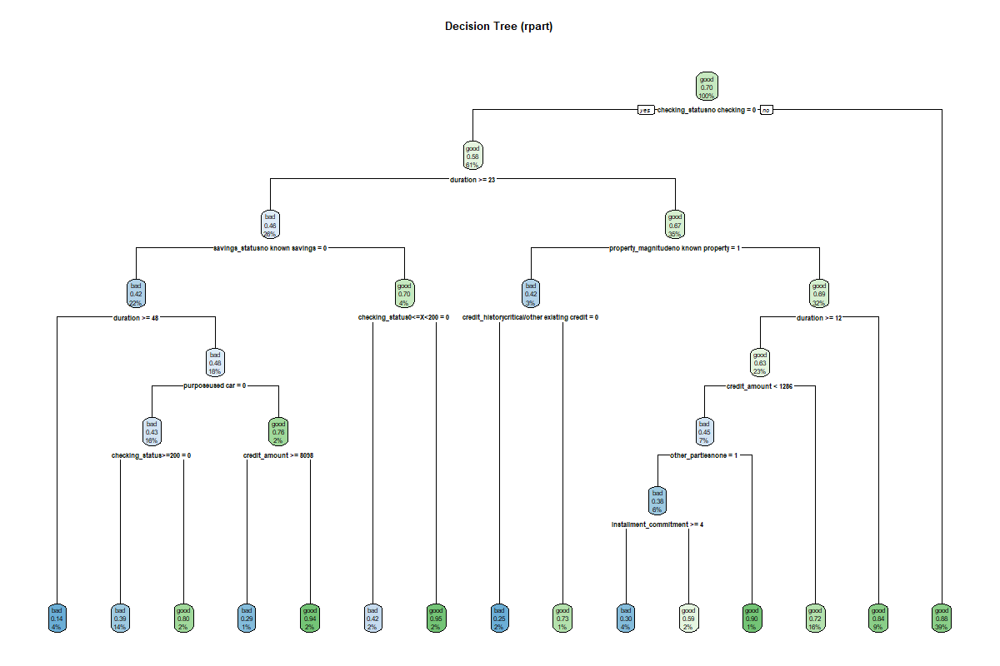

# 🧠 Classification Study

## 📌 Overview
This project explores supervised classification using visualization, interpretable models, and statistical testing.  
The workflow moves from feature-space structure → model learning → post-hoc significance testing → robustness under noise.

---

## 🎯 Objectives
- Visualize class separability in reduced dimensions
- Train an interpretable classification model
- Evaluate group mean differences using Tukey HSD
- Analyze the impact of noisy data on statistical conclusions

---

## 🗺️ Feature Space Visualization

### t-SNE Projection
t-SNE is used to project high-dimensional feature space into 2D to inspect natural class clustering.


**Insight:**  
- Clear separation → classes are learnable  
- Overlap → harder classification boundary

---

## 🌳 Classification Model

### Decision Tree
A decision tree was trained to provide an interpretable set of classification rules.



**Why this matters:**  
- White-box model
- Shows exact feature splits
- Helps explain predictions

---

## 📊 Statistical Validation

### Tukey HSD (Clean Data)
Post-hoc multiple comparison test to identify which group means differ significantly.

See full results: docs/task3_tukeyHSD.txt


**Purpose:**  
- Verify that class differences are statistically significant  
- Control family-wise error rate

---

### Tukey HSD (Noisy Data)
Same test performed after introducing noise.


**What this evaluates:**  
- Sensitivity to noise  
- Stability of statistical conclusions  
- Real-world data reliability

---

## 🔍 Key Findings
- t-SNE revealed the underlying class structure in feature space
- Decision tree provided interpretable classification logic
- Tukey HSD confirmed significant group differences
- Added noise reduced statistical separability, demonstrating model and inference sensitivity

---

## ⚙️ Tech Stack
- Python
- scikit-learn
- scipy / statsmodels
- matplotlib / seaborn

---

## 🚀 How to Run

```bash
pip install -r requirements.txt
jupyter notebook