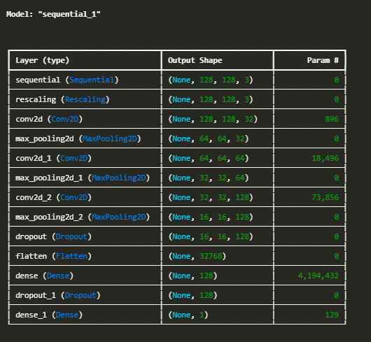
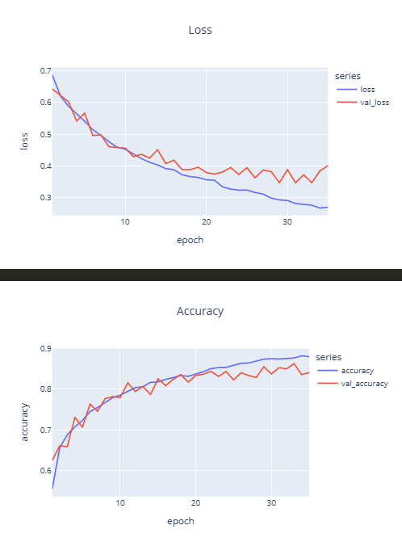
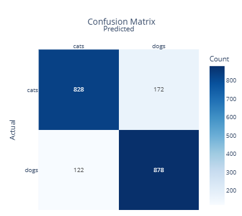
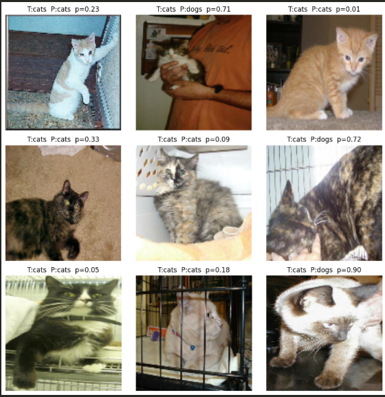

# 🐶🐱 ConvNet Image Classification — Dogs vs Cats

Convolutional Neural Network (CNN) built to classify dog and cat images (binary classification: 0 or 1).

This project was completed for DTSC 5505.

---

## 📂 Dataset

- 10,000 total images  
- 8,000 training images  
- 2,000 test images  
- Balanced classes (cats and dogs)

Original dataset source: Kaggle Dogs vs Cats

---

## 🏗 Model Architecture

- Conv2D (32 filters) + ReLU
- MaxPooling
- Conv2D (32 filters) + ReLU
- MaxPooling
- Flatten
- Dense (128 units)
- Output layer (Sigmoid)

Loss Function: `binary_crossentropy`  
Optimizer: `adam`  
Epochs: 25  

---

## 📊 Model Summary

---

## 📉 Training Performance

### Loss & Accuracy

---

## 🔎 Confusion Matrix

---

## 🐱 Example Classified Cats

---

## 🚀 How to Run

1. Create virtual environment
2. Install dependencies: pip install -r requirements_pip.txt
3. Run notebook or python file

---

## 📦 Requirements

- Python 3.x
- TensorFlow / Keras
- NumPy
- Plotly and Matplotlib

---

## 🎥 Video Demonstration

See included `.mp4` file in submission.

---

## 📌 Notes

Dataset and trained models are excluded from this repository to reduce size.