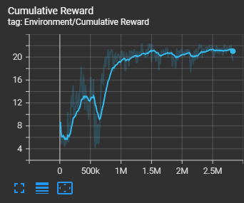

# 🏎️ BuddyKart – Point-to-Point Reinforcement Learning Agent


## Overview

BuddyKart is a reinforcement learning agent built in Unity using ML-Agents.  
The agent learns to navigate from a spawn location to a target point inside a kart-based physics environment.

This project focused heavily on:

- Reward shaping experimentation
- Directional alignment control
- Velocity regulation
- Physics-aware policy stabilization under PPO

---

## 🎥 Demo

### Start (Untrained Behavior)
[▶ Watch Start Demo](docs/videos/start.mp4)

### Finish (Trained Agent)
[▶ Watch Finished Agent](docs/videos/finish.mp4)

The start clip shows unstable exploratory behavior.  
The finish clip demonstrates consistent target acquisition without overshooting.

---

## 🧠 Environment

- Engine: Unity  
- RL Framework: Unity ML-Agents  
- Base Environment: Kart Microgame  

### Observations

The agent receives:

- Relative direction to target  
- Distance to target  
- Velocity magnitude  
- Facing alignment (dot product between forward vector and target direction)

### Actions

The agent controls:

- Throttle
- Steering

---

## 🎯 Reward Function Evolution

Reward shaping was the central focus of this project. Several designs were tested and iterated on.

---

### 1️⃣ Velocity × Facing Reward (Early Version)

```csharp
AddReward(Mathf.Max(0f, facing * rb.velocity.magnitude) * 0.01f);
Issue:

Agent became overly speed-focused.

Frequently overshot the target.

Learned to maximize velocity instead of task completion.

2️⃣ Progress-Based Reward
csharp
Copy code
float progress = previousDistance - currentDistance;
AddReward(progress * scaleFactor);
Encouraged movement toward the target.

Issue:

Momentum exploitation.

Weak directional constraint.

3️⃣ Facing-Weighted Progress
csharp
Copy code
AddReward(facing * clampedProgress);
Improvement:

Reward only forward-aligned movement.

Suppressed sideways motion.

Reduced velocity exploitation.

This produced more stable and deliberate behavior.

4️⃣ Sigmoid Velocity Matching (Final Refinement)
To prevent overshooting and encourage controlled approach speed, the reward was transformed into a sigmoid-based function that rewarded matching a desired velocity profile.

Conceptually:

csharp
Copy code
float velocityError = Mathf.Abs(rb.velocity.magnitude - targetVelocity);
float shapedVelocity = 1f / (1f + Mathf.Exp(k * velocityError));
AddReward(facing * shapedVelocity);
Why sigmoid?

Smooth gradient near target velocity

Penalizes excessive speed without harsh discontinuities

Encourages controlled convergence instead of brute-force acceleration

This significantly improved final stability and reduced oscillation near the target.

5️⃣ Terminal Success Reward
csharp
Copy code
if (distance < successThreshold)
{
    AddReward(successReward);
    EndEpisode();
}
Anchors the objective and stabilizes PPO training updates.

📊 Training Performance
Algorithm: PPO
Multi-agent training enabled to increase sample throughput.

Cumulative reward over training:


The curve shows stabilization after convergence as the policy transitions from velocity-dominant behavior to controlled target acquisition.

⚙️ Physics Tuning Insights
Key findings:

Low max speed → agent stalled near origin

High max speed → unstable overshooting

Increased drag → smoother convergence

Reduced friction → improved control

Physics parameters had a major influence on RL stability.

📁 Repository Structure
markdown
Copy code
Assets/
  Scripts/
    PointToPointAgent.cs
  Scenes/
    BuddyKart.unity

ProjectSettings/

docs/
  start.mp4
  finish.mp4
  cumulative reward.png
Not included:

Library/

Temp/

Logs/

Full ML-Agents source

Kart Microgame source

Dependencies are managed via Unity Package Manager.

🔍 Key Learnings
Reward shaping directly determines emergent behavior.

Velocity-based rewards alone create instability.

Facing alignment is critical in directional tasks.

Sigmoid shaping provides smooth policy gradients.

Physics configuration can bottleneck RL convergence.

🚀 Future Extensions
Obstacle avoidance

Curriculum-based distance scaling

Full-track racing objective

PPO vs SAC comparison

Adaptive velocity scheduling