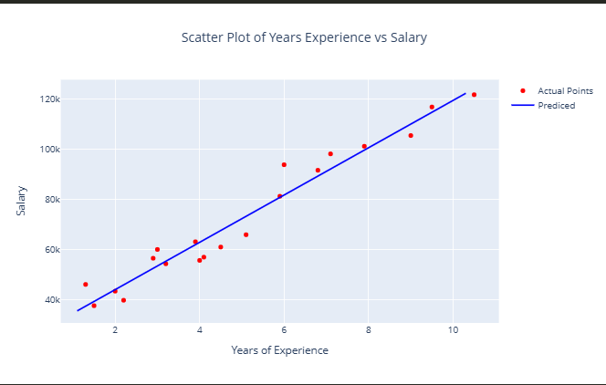
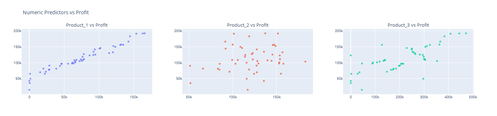
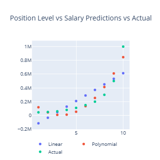

# 📈 Regression Study

## 📌 Overview
This project explores linear and nonlinear regression techniques, progressing from simple linear regression to multiple feature exploration and polynomial regression.  
The goal is to understand how model complexity improves predictive performance.

---

## 🎯 Objectives
- Fit and interpret a simple linear regression model
- Explore relationships between multiple predictors and the target
- Capture nonlinear patterns using polynomial regression
- Compare model behavior as complexity increases

---

## 📉 Simple Linear Regression

A baseline model using a single predictor with a fitted regression line.



**Key idea:**  
Establishes the fundamental relationship between one feature and the target and provides an interpretable starting point.

---

## 🔍 Multiple Regression – Feature Exploration

Scatter plots used to examine relationships between multiple predictors and the response variable.



**Why this matters:**  
- Identifies the strongest predictors  
- Reveals linear vs non-linear trends  
- Detects potential multicollinearity  

---

## 📊 Polynomial Regression

A nonlinear model that captures curvature in the data.



**Key idea:**  
Polynomial features allow the model to fit more complex patterns that a straight line cannot capture.

---

## 🧠 Key Findings
- Simple linear regression provides a strong, interpretable baseline
- Feature exploration helps guide model design and predictor selection
- Polynomial regression improves fit when relationships are nonlinear
- Increasing model complexity must be balanced against overfitting

---

## ⚙️ Tech Stack
- Python  
- scikit-learn  
- pandas  
- matplotlib / seaborn  

---

## 🚀 How to Run

```bash
pip install -r requirements.txt
jupyter notebook


regression_study/
│── notebooks/
│── docs/
│── README.md